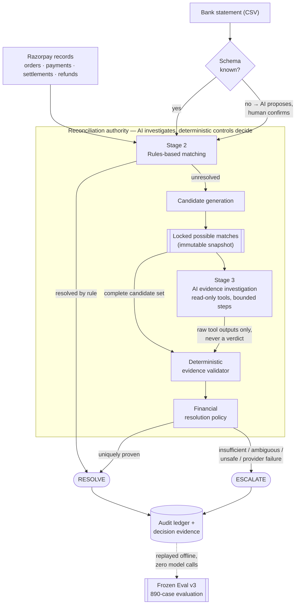
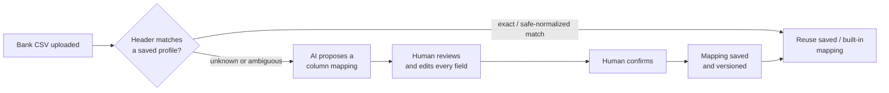

# FinRecon

**Reconcile with evidence. Escalate uncertainty.**

Every payments business runs a version of the same reconciliation problem: Razorpay
records say one thing, the bank statement says another, and someone has to decide —
case by case — whether the difference is explainable or dangerous. Get it wrong in
either direction and it costs money: miss a real match and a case sits in a queue
forever; force a wrong match and money moves on a guess.

FinRecon is a reconciliation controller built around one invariant:

> **The agent may enrich the case. It may not shrink it.**

A deterministic core resolves everything it can prove from IDs and arithmetic. What's
left goes to a bounded AI investigator that can *look* at evidence — bank narration,
settlement break-ups, refund lines — but cannot decide anything. Every automatic
resolution is authorized by a deterministic validator and a deterministic financial
policy, never by model confidence. When the evidence is insufficient, unsafe,
ambiguous, or unavailable because a provider call failed, the system escalates
instead of guessing.

**Frozen Eval v3 — 890 synthetic cases, provider-recovered result:**

| | |
|---|---:|
| Resolvable cases reconciled correctly | **850 / 850** |
| Genuinely ambiguous cases safely escalated | **40 / 40** |
| Wrong automatic resolutions | **0** |
| Value at risk | **₹0** |

Full provenance, including the original operational run and how the numbers above
were reached, is in [Frozen Eval v3](#frozen-eval-v3) below.

---

## Why FinRecon

**Reconciliation failures are financially dangerous, not cosmetic.** An
auto-matcher that's "95% confident" is still authorizing money movement on a
probability. In a reconciliation controller, a wrong automatic match is not a bad
UX moment — it's a wrong payout, a wrong refund, or a hole in the ledger that someone
finds weeks later.

**Fuzzy or LLM-confidence matching is not sufficient authority.** A language model
is very good at investigating — reading a truncated UTR, checking whether a fee
break-up nets to the right paise, noticing that a refund explains a residual. It is
not an auditable financial authority, and it should never be asked to be one.

**FinRecon separates evidence search from financial authorization.** AI
investigates. Deterministic controls decide. Those are different jobs with different
failure modes, and this system keeps them in different components:

| Job | Owner | Can it move money? |
|---|---|---|
| Find and read evidence | Stage-3 AI investigator | No — read-only tools, no write path |
| Prove a candidate is uniquely identified | Deterministic validator | No — proves, doesn't decide |
| Authorize resolve vs. escalate | Deterministic financial policy | **Yes — the only component that can** |

---

## How it works



**Bank onboarding is deliberately outside this loop.** It decides which column is
"amount", not whether a case reconciles — see [Bank onboarding](#bank-onboarding--schema-mapping).

The stages, briefly:

- **Stage 2 — rules-based matching.** Whole-token exact key matches (UTR,
  `settlement_id`) and derived reconciliation (fee/GST/TDS break-up to the exact
  paise, value-date windows). No scoring, no similarity, no LLM. This alone
  resolves 650 of 890 Frozen Eval v3 cases.
- **Candidate generation.** Every case Stage 2 can't close is frozen as an
  **immutable snapshot**: the complete plausible candidate set plus base evidence,
  content-hashed so later tampering is detectable. This snapshot — not the agent's
  opinion of it — is what the validator eventually reads.
- **Stage 3 — AI evidence investigation.** A bounded loop over four read-only
  tools (parse narration, inspect settlement break-up, inspect refunds, compare
  reference tokens) with a fixed step budget. No tool can rank, score, hide, or
  resolve a candidate — see [Safety model](#safety-model).
- **Deterministic validator.** A candidate is identified only when it is the
  *only one* consistent with every informative claim the bank narration supports
  — including claims the agent never explicitly asked about. Agent prose is not
  an input.
- **Financial resolution policy.** Hard blockers, exact-paise accounting, and
  value-aware thresholds decide RESOLVE or ESCALATE. Model confidence is never
  consulted.

---

## Safety model

| Guarantee | How it's enforced |
|---|---|
| Money never rounds | Integer paise throughout; no float on the financial path |
| The agent cannot shrink a case | The candidate snapshot is immutable; tools receive it and nothing writable |
| The agent cannot rank or resolve | No tool output carries a score, rank, confidence, or `is_match` field; the policy gate's signature takes no agent input |
| The agent cannot fish by omission | The validator re-tests **every** candidate against the narration's complete deterministic closure, not just what the agent looked at |
| The agent cannot write anything | No Stage-3 tool imports the database, the ledger, or the pipeline |
| Failure escalates, never guesses | A missing tool result, a provider outage, or an exhausted step budget routes to escalation, never a best-effort match |
| Every decision is audited | Resolutions *and* refusals are persisted with rule ID, matched IDs, and exact-paise derivation; reprocessing a batch is a no-op |
| Hidden truth stays hidden | The benchmark's ground truth is readable only inside the Stage-4 evaluator, which sits outside the installed package and cannot decide anything or call a model — asserted structurally by `tests/test_benchmark_isolation.py` |

---

## Frozen Eval v3

A frozen, hashed, 890-case synthetic benchmark across four tiers:

| Tier | Cases | What has to happen |
|---|---:|---|
| T0 — direct key | 350 | Intact UTR / settlement ID — Stage 2 resolves |
| T1 — derived | 300 | Structured break-up arithmetic — Stage 2 resolves |
| T2 — degraded reference | 200 | Two settlements are equally plausible until a truncated/masked/reordered UTR fragment is recovered from the bank narration |
| T3 — truly ambiguous | 40 | No usable reference exists; ground truth is escalation |

Stage 2 resolves T0 + T1 deterministically: **650 / 650**, zero model calls. The
residual **240 cases** (T2 + T3) go to Stage 3, and all **240 / 240** have committed,
frozen trajectories.

**The headline, provider-recovered result:**

| | Cases | Correct | Escalated | Wrong |
|---|---:|---:|---:|---:|
| T2 — degraded reference | 200 | **200** | 0 | 0 |
| T3 — truly ambiguous | 40 | — | **40** | 0 |
| **Combined with Stage 2** | **890** | **850 / 850 resolvable** | **40 / 40** | **0** |

Source: [`benchmark/reports/frozen-eval-v3-opus5-thinking-provider-recovered-240.json`](benchmark/reports/frozen-eval-v3-opus5-thinking-provider-recovered-240.json).

Because 40 cases are intentionally unresolvable, the suite-level result is
**850 / 850 resolvable cases reconciled correctly** and **40 / 40 genuinely
ambiguous cases safely escalated**. Of those 40 escalations, 33 followed a
completed investigation and 7 followed a provider infrastructure failure; the
latter failed closed without authorizing a match.

### Provider-failure provenance

The original operational run — before any retry — is preserved separately:
[`frozen-eval-v3-opus5-thinking-operational-raw-240.json`](benchmark/reports/frozen-eval-v3-opus5-thinking-operational-raw-240.json).

- T2: **187 / 200** resolved correctly, **0 wrong**. The other 13 terminated with
  `provider_infrastructure_failure`. Some failures occurred after partial
  investigation, but none produced an automatic resolution: the system failed
  closed and authorized no unsafe match.
- T3: all 40 escalated correctly. 33 escalated after a complete investigation
  found no usable reference; **7 escalated because a provider infrastructure
  failure prevented investigation from completing.** The system failed closed and
  authorized no unsafe match.

The 13 T2 provider failures were retried individually under the exact same frozen
configuration — requested model, prompt, tools, validator, policy, and investigation
budget — and all 13 reached deterministic policy resolution. Stage-4 evaluation
against hidden ground truth confirmed all 13 correct, producing the provider-recovered
**200 / 200**. Nothing about the deterministic decision layer changed between the two
runs; only the provider calls that had previously failed were re-attempted.

### What a model actually bought here

A deterministic, non-LLM baseline exists — the same tools, validator, and policy,
driven by a mechanical (not language-model) investigator over the identical 890-case
set, reproduced by `make eval`:

| | T2 resolved | T2 escalated | T2 wrong | Combined correct |
|---|---:|---:|---:|---:|
| Deterministic mechanical baseline | 173 / 200 | 27 | 0 | 823 / 850 |
| Opus, provider-recovered | **200 / 200** | 0 | 0 | **850 / 850** |

Source: [`benchmark/reports/final-eval.json`](benchmark/reports/final-eval.json)
(`frozen_core.metrics_by_tier.T2`). Opus recovers **+27 T2 cases** over the
mechanical baseline, at zero wrong resolutions in either arm — the model's
contribution here is finding reference fragments a fixed heuristic can't, not
overriding what the deterministic layer would have decided.

### Integrity / reproducibility

Frozen benchmark and report hashes (SHA-256), committed at
[`benchmark/reports/frozen-eval-v3-opus5-thinking-hashes.txt`](benchmark/reports/frozen-eval-v3-opus5-thinking-hashes.txt)
and [`benchmark/manifests/v3.json`](benchmark/manifests/v3.json):

```
frozen-eval dataset (v3)          f9eb8770be6cc216d1c8b5486a10b74005382141f7c079844e2748444a44fc5b
canonical 240-trajectory corpus   712db853df1e77431f6ac27b7f965c866674569a577fcd8d207b4e956b164d5d
original 13 T2 provider-failures  9fa481e7f2b1206cbb99817a92027327b33c3dc8cc0c2e20a3ab8180c935eb57
operational raw Stage-4 report    c4fe6cdd93529a197e529afb60637883ac3d543fde8f199136033a7bc031a8c7
provider-recovered Stage-4 report 0b6d4b706a87c2e7977e08310d0c113a833f162bb7a9f88c085e64fdfc5cd825
```

---

## Offline replay

**OFFLINE REPLAY · ZERO MODEL CALLS**

The UI and API can replay the complete Frozen Eval v3 result — all 890 cases, all
650 Stage-2 resolutions, all 240 / 240 frozen Stage-3 trajectories, the 200 T2
resolutions and 40 T3 escalations — from committed artifacts. This is not a live
rerun:

- Uses the frozen, committed trajectory cache (`chain=None`, replay-only enforced).
- Reruns the **real** deterministic validator and financial policy against the
  cached raw evidence, so the decision shown is the decision the controller
  actually took, not a reimplementation of it.
- Reads hidden ground truth only afterward, inside the Stage-4 boundary.
- Requires no provider credential and makes no network call. A missing or
  version-drifted cached trajectory fails the replay closed rather than falling
  back to a live model call.

Two separate offline reproduction paths exist in this repo, and they answer
different questions:

| Path | What it replays | Result |
|---|---|---|
| `python -m benchmark.final_eval` (`make eval`) | The deterministic mechanical investigator, no model ever involved | 823 / 850 correct (the baseline table above) |
| API `POST /api/benchmarks/{id}/replay`, surfaced in the Evaluation workspace | The committed Opus trajectory cache | **850 / 850** correct (the headline result) |

---

## Bounded Search benchmark

A separate, smaller (50-case) benchmark for judges who want to inspect individual
investigator behavior rather than aggregate numbers: locked possible matches, the
exact tool calls an investigator made, the deterministic validator's evaluation,
and the resolve/escalate outcome, case by case.

Of the 50 cases, **40 are benchmark-resolvable by construction**; the other 10 have
no unique answer. Two committed cohorts, with different denominators — reported
separately because comparing them directly would compare different things:

| Cohort | Persisted | Valid / scored | Resolvable-and-valid | Wrong |
|---|---:|---:|---:|---:|
| Opus (`claude-opus-5-thinking`) | 50 | 50 (complete) | 40 | 0 |
| OpenRouter Free Model Pool | 50 | 45 | 38 | 0 |

Opus found sufficient admissible evidence for all 40 resolvable cases and correctly
escalated the remaining 10; the deterministic validator and policy authorized every
resulting resolution. The two cohorts ran under different recorded configurations
(model, provider, prompt path) — both remain visible in their reports rather than
merged into one number.

---

## Bank onboarding / schema mapping

FinRecon expects a **preprocessed, clean bank CSV** with the header on the first
row — no preamble/footer scanning, no XLSX, no MT940/camt.053 (tracked as future
work, not currently implemented).



This is a separate authority from reconciliation, and it shares no prompt, tool set,
or decision logic with the Stage-3 investigator — only a generic provider-connection
abstraction. Nothing it proposes is persisted, and nothing it proposes feeds a
reconciliation decision, until a human confirms it:

- **Known schema** (`src/finrecon/adapters/bank/schema/detect.py`) — only exact
  or whitespace/case/BOM-normalized header matches auto-select a saved profile.
  Anything needing synonym matching or reordering is treated as unknown.
- **Unknown schema** — the server proposes a mapping via one constrained model
  call, with column choices restricted to the file's actual headers
  (`src/finrecon/adapters/bank/mapping/`, `POST /api/bank-mappings/propose`).
- **Human confirmation is enforced server-side**, not just in the UI: saving
  requires resubmitting the full mapping and the original file bytes, which the
  server independently re-validates; any field the sample data can't settle must
  be explicitly present in `confirmed_fields` or the request is rejected
  (`422 human_confirmation_required`).
- **Saved mappings are versioned**, never overwritten (`src/finrecon/ledger/bank_mappings.py`)
  — each confirmation creates a new version, and old versions remain readable.

---

## Demo / UI

Suggested walkthrough for a judge:

1. **Overview** — deterministic vs. evidence-assisted vs. escalated outcomes at a
   glance.
2. **Easy case** — Stage 2 resolves a case with no model involved.
3. **Hard case** — locked candidates → Stage-3 evidence investigation → validator
   → policy decision, inspectable step by step.
4. **Safe escalation** — a case with no safe evidence path, escalated rather than
   guessed.
5. **Frozen Eval v3** — replay all 890 cases offline, zero model calls, and land
   on the 850 / 850 · 40 / 40 · 0 wrong result.
6. **Bank schema mapping** — upload a CSV with an unrecognized schema, review the
   AI's proposed mapping, and confirm it.

No screenshots are committed yet. Recommended additions under `docs/assets/` before
a public submission, five is enough:

1. Overview dashboard
2. Frozen Eval v3 replay result
3. A T2 case's evidence trail (resolved)
4. A T3 case's evidence trail (safely escalated)
5. Bank schema mapping review screen

---

## Run locally

Docker is the primary path. No provider credential is required to start —
Replay, Demo, and Benchmarks all work without one; only Live investigation needs
one.

```bash
git clone <this-repo-url> finrecon
cd finrecon
docker compose up --build
```

Open `http://localhost:8000` (health check at `/api/health`). The SQLite ledger
persists in the named `finrecon-data` volume; override its path with
`FINRECON_LEDGER_PATH`.

To enable Live investigation, copy `.env.example` to `.env` and set one provider
credential before starting the container — `OPENROUTER_API_KEY`, `GROQ_API_KEY`,
`GEMINI_API_KEY`, or `GOROUTER_API_KEY`. Credentials are backend environment
variables only, never accepted from the browser.

### Native dev setup

```powershell
python -m venv .venv
.\.venv\Scripts\Activate.ps1
make install
```

```bash
uv run --extra dev uvicorn finrecon.api.app:app --reload --host 127.0.0.1 --port 8000
# in a second terminal
cd web && npm ci && npm run dev
```

Open `http://127.0.0.1:5173`.

---

## Test / verification

```bash
uv sync --extra dev
uv run python -m benchmark.final_eval   # the one-command submission path — no network, no API key
uv run pytest                           # full repository test suite
```

Equivalent Make targets on systems with GNU Make: `make eval`, `make test`.

```bash
make verify-frozen      # recompute the FROZEN-EVAL SHA-256 against the committed manifest
make test-stage3        # investigation layer, deterministic fake providers
make test-stage4        # the offline evaluator's own tests
make test-isolation     # asserts reconciliation code cannot read hidden ground truth
```

---

## Project structure

```
src/finrecon/
├── models/         canonical record schemas, integer-paise money
├── normalize/       UTC timestamps, deterministic ordering, provenance
├── matchers/        Stage 2 — direct-key and derived reconciliation
├── candidates/       candidate generation, immutable case snapshots
├── agent/            Stage 3 — tools, provider chain, bounded loop, trajectory cache
├── evidence/         deterministic reference closure
├── decide/           validator + financial policy gate
├── adapters/bank/     bank CSV parsing, schema detection, mapping proposal
├── ledger/           SQLite ledger, audit trail, bank-mapping storage
└── api/               FastAPI app: reconciliation, benchmarks, bank mappings

benchmark/
├── manifests/        frozen generator versions, seeds, tier counts, hashes
├── datasets/          generated inputs (dev / frozen-eval / v4-pilot)
├── ground_truth/      hidden truth, readable only by eval/
├── baselines/         deterministic diagnostic arms, zero provider calls
├── eval/              Stage 4 — the only layer that reads truth and scores
└── reports/            committed benchmark results and hash manifests

web/src/
├── pages/             Overview, Queue, CaseDetail, Run, Benchmarks, Issues
└── components/         MappingEditor, evidence/trajectory views
```

Full technical specification: [`DESIGN.md`](./DESIGN.md).

---

## Limitations

Stated plainly, not to be found later:

- **Synthetic data.** The benchmark's narration and corruption taxonomy were
  authored by the same person who built the matcher being evaluated. Freezing
  the eval set prevents overfitting to *instances*, not to the *distribution*.
  This does not reproduce every bank's narration format, partial file delivery,
  schema drift, late correction files, settlement reversals, the chargeback
  lifecycle, multi-currency accounting, or bank holidays.
- **Bank input is scoped to clean CSV.** No preamble/footer scanning, no XLSX, no
  MT940/camt.053 — see [Bank onboarding](#bank-onboarding--schema-mapping).
- **Only one bank profile ships built-in**, a demo fixture — no real bank's
  format is pre-loaded; every other bank goes through the AI-proposal +
  human-confirmation path.
- **Human resolution is per-case, not a workspace.** A case can be resolved with
  a recorded reason; there's no bulk-action or approval-chain queue yet.
- **Provider availability can fail**, and did during the frozen run (13 T2 + 7
  T3 cases). The system fails closed rather than guessing — by design — but that
  means live investigation depth is bounded by third-party API reliability.
- **This is a reproducible benchmark result, not a claim of accuracy on
  arbitrary real-world data.** Reported numbers come from cached model
  trajectories; a live run against a hosted model may diverge, and any measured
  drift is reported separately, not folded into the frozen numbers above.

## Future work

- A human-resolution workspace with bulk triage, not just single-case resolution.
- Bank format coverage beyond clean CSV — XLSX, MT940/camt.053, preamble/footer
  tolerant parsing.
- Richer production integrations (settlement reversals, chargebacks,
  multi-currency, late correction files).
- Provider cost/latency telemetry surfaced alongside trajectories, not just in
  raw reports.
